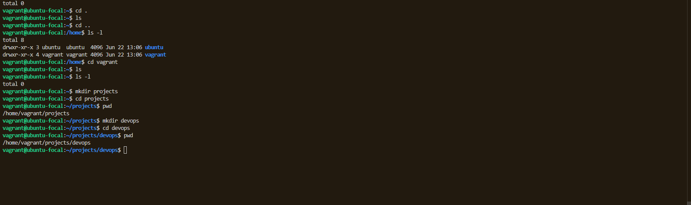

# Task: Linux Fundamentals Project with Vagrant
## Objective
You are to set up a GitHub repository and complete a set of Linux system administration tasks using Vagrant on your local machine. You'll document your work with screenshots and descriptions in a README.md file.
##  1. Set Up a Vagrant Server
### Screenshot 1: Show the Vagrant initialization and login process

Add a short description under the screenshot explaining what you're doing.
> This screenshot shows the Vagrant initialization process (vagrant init), the VM startup with vagrant up, and successfully SSH-ing into the Ubuntu virtual machine using vagrant ssh. It confirms the VM is running and ready for Linux administration tasks.
## 2. Explore the Linux File System
### Screenshot 2: Show the created folder structure

Describe the structure you created
> I created a custom folder that will contain some of the script for automation and other stuff for DevOps. 
## 3. Manage File Permissions and Ownership
### Screenshot 3: Create files and use chmod and chown to change its permissions and ownership.

> Briefly explain the meaning of the permission and ownership values.
#### Permission in linux is the consent to use a file or folder. thy're 3 set of people that can be granted permission or permission can be removed from they're.
 ##### User: the person who created or owns the file. U 
 ##### Group: A set of users who might also have access. G 
 ##### Others: Other set of people that might be interested in using the file. O 
 > the permissions are 
- read -r  
-  write -w
- execute -x
 > -rwxrwxrwx or drwxrwxrwx
Where the `-` represents that it's a file and `d` represents that it's a directory.

### The permissions are calculated like this:

- Read = 4  
- Write = 2  
- Execute = 1  

### Example: Give Full Permissions to Everyone

```bash
chmod 777 HelloWorld
```

> Linux uses an ownership model to control access to files and directories. Each file has:
- **User (Owner)** – usually the person who created the file.
- **Group** – a collection of users who share access rights.

#### 🧪 Example
When you run:
```bash
ls -l filename 
-rw-r--r-- 1 rasheed devops 2048 Jun 22 14:00 example.txt
```
### Changing Ownership
You can use chown to assign a new owner or group:
- sudo chown newuser:newgroup filename
## 4. 📦 Installing and Configuring a Package with apt in Linux

In this section, I used the `apt` package manager to install a basic software package inside my Vagrant virtual machine running Ubuntu.

### 🔧 Step-by-Step Process


   sudo apt install curl ```
   ### Verify the installation:
   ```bash
   curl --version
```
### Screenshot4: Show the package being installed and version confirmation.


## 5. 🌐 Testing Remote Connectivity

To verify that the virtual machine can communicate with an external server, I used the `ping` command.

### 🔧 Command Used

```bash
ping -c 4 google.com
```
### screenshot5: Show the ping result.
 Mention what the output shows and why it’s useful.

> The output confirms successful communication between my VM and Google's server. All 4 packets were sent and received with 0% packet loss, which means there is no network issue. The time values show round-trip latency in milliseconds, which helps measure connection speed and quality. This is useful for verifying that internet connectivity is working properly inside the virtual machine.
